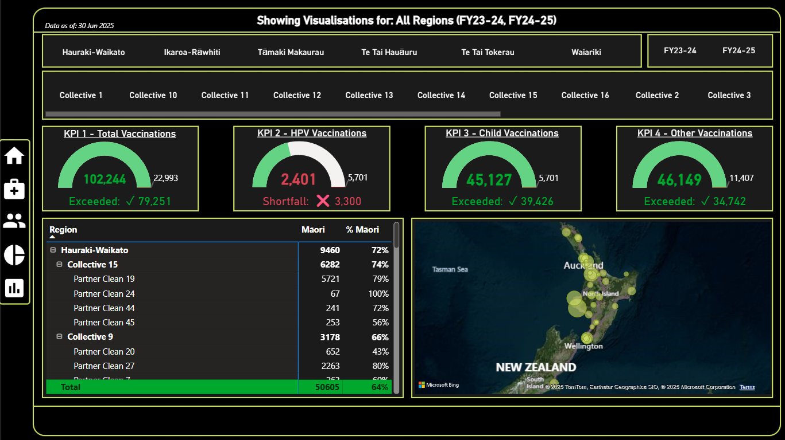
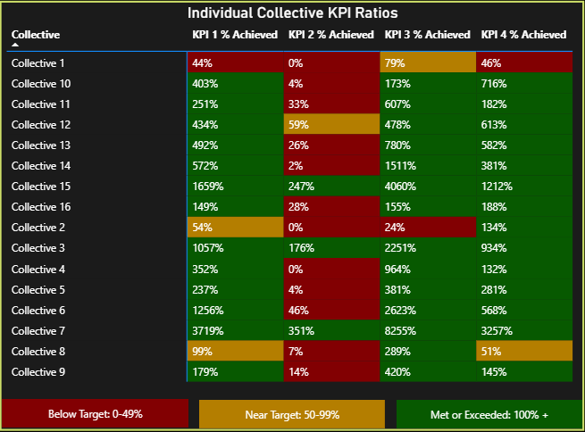
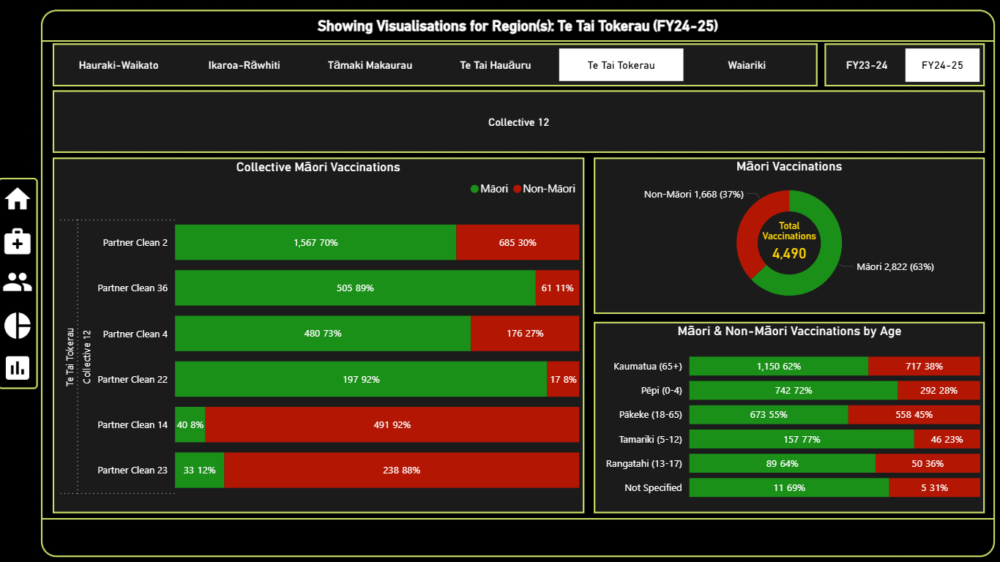

# Vaccination Rollout Dashboard (Power BI)

**Purpose:** A portfolio-ready Power BI project analysing vaccination performance and equity across regions in Aotearoa New Zealand.  
The dashboard tracks four KPIs, compares Māori and Non-Māori outcomes, and demonstrates clean data modelling with Power Query (M) and DAX.

> **Data/privacy:** Built from real programme data that has been fully anonymised. No raw data is published in this repository.

---

## 🧭 Contents
- [Overview](#overview)
- [Key Features](#key-features)
- [Screenshots](#screenshots)
- [Exports (PDF)](#exports-pdf)
- [Data & Model](#data--model)
- [Transformations (M & DAX)](#transformations-m--dax)
- [Repository Structure](#repository-structure)
- [Reproduce (without sensitive data)](#reproduce-without-sensitive-data)
- [Notes & Limitations](#notes--limitations)
- [Roadmap](#roadmap)

---

## Overview

This dashboard surfaces vaccination performance by **Region**, **Collective**, **Provider**, **Age Group**, and **Vaccine Type**.  
It highlights equity by showing **Māori vs Non-Māori** counts and ratios, and provides KPI targets vs actuals with intuitive colour rules.

**Primary questions it answers**
1. Are KPIs being met or missed, and by how much?
2. How do results vary across regions and collectives?
3. What are the equity patterns across age groups?

**Tools & skills**
- Power BI (data model, UX, theming)
- Power Query (M) for ETL (unpivot, imputation, rounding)
- DAX for KPI logic, dynamic titles, and heatmap ratios
- Git & documentation for portfolio presentation

---

## Key Features

- **KPI Cards & Gap Text** — clear “Exceeded / Met / Shortfall” messaging with the exact numeric gap.  
- **Heatmap Matrix** — per-Collective KPI ratio (Actual ÷ Target) with colour rules and safe context handling.  
- **Equity Views** — Māori vs Non-Māori breakdowns by age group and vaccine type.  
- **Dynamic Titles** — headings adapt to Region/Year slicers for clearer storytelling.  
- **Anonymised Mapping** — providers and locations shown without exposing sensitive detail.

---

## Screenshots

> Full-size images live under `exports/screenshots/` for recruiters to scan quickly.

**Overview**

**KPI Heatmap by Collective**

**Ethnicity & Age Breakdown**

**Filtered Regional View (example)**

---

## Exports (PDF)

Portfolio-friendly PDFs (A4 landscape) showing the full dashboard state:

- `exports/Vaccination_Rollout_Dashboard.pdf` — **All Regions** (no slicers active)  
- `exports/Vaccination_Rollout_Dashboard_Filtered.pdf` — **Slicer example** (Region/Year active)

> These are intended for quick review without needing Power BI Desktop.

---

## Data & Model

- **Real data** was used to design and test logic, then **fully anonymised** for publication.  
- Source tables: `INPUT_table`, `KPI_combined`, `Bridge_combined`, `Address_table`.  
- Final fact table: `Final_INPUT_Table` (reported + imputed rows, long format).

See **`data/data_dictionary.md`** for column definitions and KPI semantics.  
See **`data/Sample_Data_README.txt`** for privacy notes and how to stub data.

---

## Transformations (M & DAX)

- **Power Query (M):**  
  - Unpivot age columns, impute “Not Specified” where totals don’t reconcile, calculate Māori totals, normalise names/order.  
  - File: `transformations/PowerQuery_M.txt`

- **DAX:**  
  - `_KPI X Target`, `_KPI X Actual`, heatmap `% Achieved` (row-safe), colour & gap text, dynamic titles, equity measures.  
  - File: `transformations/DAX_Measures_FINAL.md`

---

## Repository Structure

- README.md
- .gitignore
- data
    - data_dictionary.md
    - Sample_Data_README.txt
- exports
    - Vaccination_Rollout_Dashboard.pdf
    - Vaccination_Rollout_Dashboard_Filtered.pdf
    - screenshots
        - 01_overview.png
        - 02_filtered_te-tai-hauāuru.png
        - 03_kpi_matrix.png
        - 04_ethnicity_age.png
- transformations
    - PowerQuery_M.txt
    - DAX_Measures_FINAL.md
- scripts (# reserved for future automation (optional))

---

## Reproduce (without sensitive data)

1. Create CSV/XLSX placeholders matching `data_dictionary.md`.  
2. Load into Power BI; paste the scripts from `/transformations/`.  
3. Replace map points with synthetic or public coordinates if needed.  
4. Open visuals — the measures and layout will function with the stub data.

> The original `.pbix` is not included to avoid publishing internal data connections.

---

## Notes & Limitations

- Percentages >100% in the KPI matrix may appear for small targets; this is **intentional** and reveals genuine performance variance.  
  - For readability, you can cap display at `>1000%` in cell formatting.  
- Map tiles show vendor copyright text per Bing/OpenStreetMap terms.  
- Year & Region slicers intentionally drive the dynamic title; Collective names are hidden from the title to prevent re-identification.

---

## Roadmap

- Optional public demo `.pbix` with synthetic data.  
- Lightweight Python/SQL scripts for automated export and repo refresh.  
- Additional measures: weighted totals and confidence intervals (if targets vary).

---
